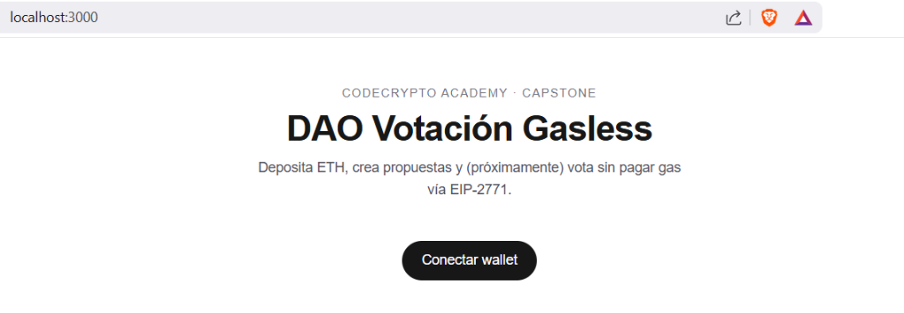

# DAO Votacion Gasless

> Proyecto del curso de **CodeCrypto Academy**.
> Una DAO donde votar **no cuesta gas** — usa meta-transacciones (EIP-2771).

## ¿Qué hace?

Una organización autónoma descentralizada (DAO) donde:

1. Los usuarios **depositan ETH** al fondo común (tesoro de la DAO).
2. Los usuarios con **≥10% del tesoro real** del DAO pueden **crear propuestas** (transferir X ETH a una dirección) — con **descripción obligatoria**.
3. Cualquier depositante puede **votar** (a favor / en contra / abstención) **sin pagar gas**. Es **una persona, un voto**: no pondera por el ETH depositado.
4. Tras el deadline + un retardo de seguridad, un **daemon** ejecuta automáticamente las propuestas aprobadas.

## ¿Cómo funciona la votación gasless?

El usuario **firma** un mensaje EIP-712 en su wallet (gratis, off-chain). Un *relayer* recibe esa firma, la envía al `MinimalForwarder` y **paga el gas** en su nombre. El `DAOVoting` hereda de `ERC2771Context`, lo que le permite extraer la dirección original del firmante en vez de quedarse con la del relayer.

```
Usuario      Frontend         /api/relay         MinimalForwarder      DAOVoting
  │  firma      │                  │                     │                  │
  ├─────────────▶                  │                     │                  │
  │             ├──────────────────▶                     │                  │
  │             │                  ├─ execute(req,sig) ──▶                  │
  │             │                  │                     ├── vote(...) ─────▶
  │             │                  │                     │   (msg.sender =  │
  │             │                  │                     │    usuario)      │
  │             ◀── tx hash ───────┤                     │                  │
```

## Demo

> Recorrido completo del escenario del brief. Guión de grabación:
> [`docs/05-guion-demo.md`](docs/05-guion-demo.md) · diagramas de secuencia:
> [`docs/diagramas/flujo-gasless.md`](docs/diagramas/flujo-gasless.md).

**1. La app sin conectar**



**2. Tras depositar — el tesoro y tu aporte**


**3. Crear una propuesta** (descripción obligatoria, beneficiario, cantidad, deadline)


**4. ⭐ El voto gasless — MetaMask pide FIRMAR, no enviar transacción**

> La pieza estrella: votar no cuesta gas. El usuario firma datos EIP-712; el relayer
> paga el gas por él.


**5. Contadores de votos** (una persona, un voto)


**6. El daemon ejecuta las propuestas aprobadas**


**7. Modelo contable A+ — el tesoro baja, el aporte no**


## Estructura

- `sc/` — contratos Solidity (Foundry)
- `web/` — frontend Next.js 15
- `docs/` — teoría y plan paso a paso (**empieza por aquí si estás aprendiendo**)

## Setup rápido

### Requisitos

- [Foundry](https://book.getfoundry.sh/getting-started/installation) (`forge`, `anvil`, `cast`)
- Node.js 20+ y npm
- MetaMask en tu navegador

### Instalación

```bash
git clone <este repo>
cd DaoVotacionGasless

# Contratos
cd sc
forge install
forge build
forge test

# Frontend
cd ../web
npm install
cp .env.local.example .env.local   # rellena con tus addresses
```

### Correr end-to-end en local

```bash
# Terminal 1 — nodo local
anvil

# Terminal 2 — desplegar contratos (desde sc/)
forge script script/Deploy.s.sol \
  --rpc-url http://127.0.0.1:8545 \
  --private-key 0xac0974bec39a17e36ba4a6b4d238ff944bacb478cbed5efcae784d7bf4f2ff80 \
  --broadcast
# copia las addresses impresas a web/.env.local

# Terminal 3 — frontend (desde web/)
npm run dev          # http://localhost:3000
```

¿Solo quieres validar el escenario del brief sin hacer nada a mano? Desde `web/`:

```bash
npm run e2e          # levanta anvil + deploy + next dev efímeros, valida y limpia
```

## Documentación

- **`CLAUDE.md`** — convenciones, stack, comandos.
- **`docs/00-plan-paso-a-paso.md`** — plan de implementación con explicaciones.
- **`docs/01-conceptos.md`** — qué es EIP-2771, EIP-712, ECDSA, etc.
- **`docs/02-smart-contracts.md`** — diseño de los contratos.
- **`docs/03-frontend.md`** — diseño del frontend.
- **`docs/04-relayer-y-daemon.md`** — el relayer, el daemon y el E2E automatizado.
- **`docs/05-guion-demo.md`** — guión para grabar el video de demostración.
- **`docs/diagramas/flujo-gasless.md`** — diagramas de secuencia (Mermaid).

## Licencia

MIT (curso educativo).
