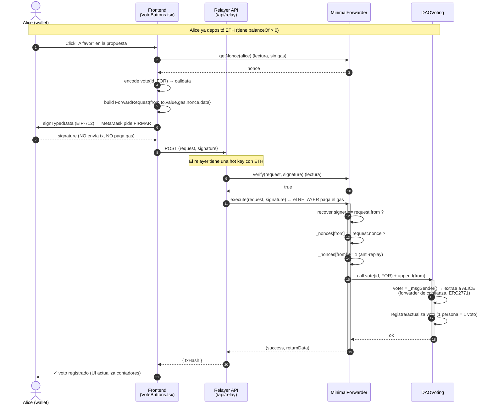
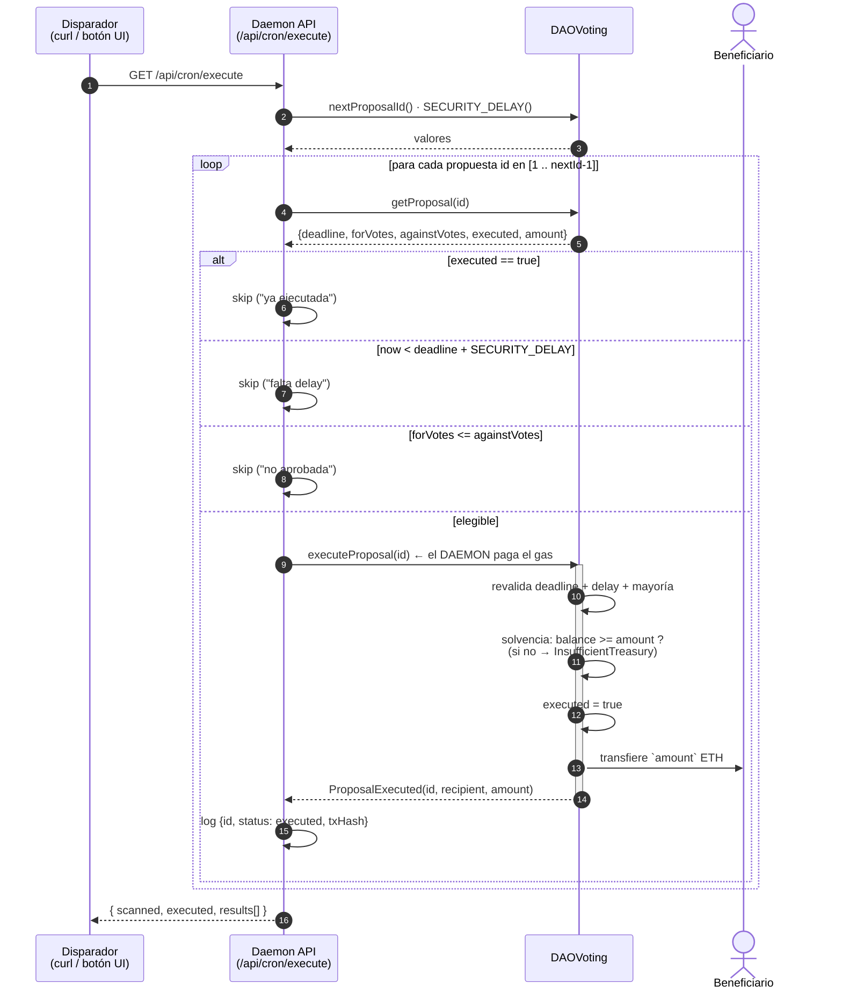
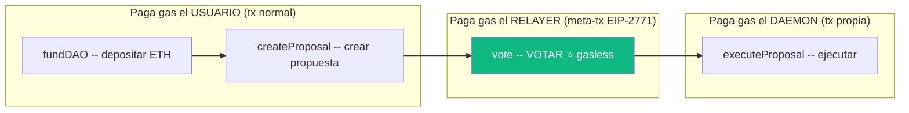

# Diagramas — Flujo gasless (EIP-2771)

> Diagramas de secuencia del proyecto. GitHub renderiza los bloques ` ```mermaid `
> automáticamente. Teoría asociada: [`../04-relayer-y-daemon.md`](../04-relayer-y-daemon.md).

---

## 1. ⭐ Voto gasless — el flujo estrella

Cómo Alice vota **sin pagar gas**: firma una meta-transacción EIP-712 off-chain; el
relayer la ejecuta on-chain pagando el gas; el contrato atribuye el voto a Alice (no al
relayer) gracias a `ERC2771Context._msgSender()`.



**Claves del diagrama:**

- Pasos **7–8**: Alice **firma**, no envía transacción → coste de gas para ella = **0**.
- Paso **13**: el `execute` lo manda el **relayer** desde su propia wallet → él paga el gas.
- Paso **17**: `_msgSender()` de `ERC2771Context` devuelve **Alice**, no el relayer ni el
  forwarder, porque el forwarder añade `request.from` al final del calldata y el DAO
  confía en él (se lo pasó en el constructor).
- Pasos **14–16**: verificación de firma + nonce → **anti-replay** (una firma no se
  puede reusar).

---

## 2. Ejecución de una propuesta por el daemon

Esto **no es gasless**: el daemon es un servicio con su propia key que paga el gas
directamente. No requiere firma de ningún usuario (las reglas ya se cumplieron).



**Claves del diagrama:**

- El daemon **filtra** off-chain (skips) pero el contrato **revalida** todo on-chain en
  `executeProposal` — nunca se confía solo en el cliente.
- Check de **solvencia** (modelo A+): si el tesoro real no cubre el `amount`, revierte
  con `InsufficientTreasury` en vez de un fallo opaco del `call`.
- El pago sale del **pozo común** del contrato; `balanceOf`/`totalDeposits` no se tocan
  (siguen siendo peso de gobernanza).

---

## 3. Quién paga gas y quién no (vista global)



> El brief solo exige que **votar** sea gasless (la acción más frecuente). Depositar y
> crear propuesta son operaciones puntuales que es razonable que pague el usuario.
